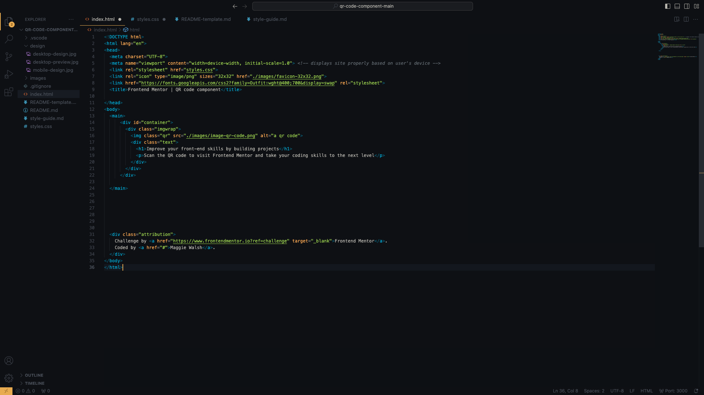
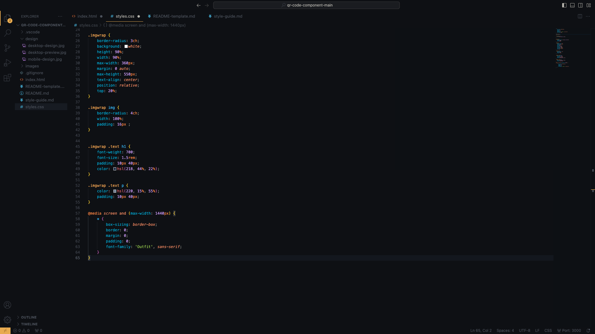

# Frontend Mentor - QR code component solution

This is a solution to the [QR code component challenge on Frontend Mentor](https://www.frontendmentor.io/challenges/qr-code-component-iux_sIO_H). Frontend Mentor challenges help you improve your coding skills by building realistic projects. 

## Table of contents

- [Overview](#overview)
  - [Screenshot](#screenshot)
  - [Links](#links)
- [My process](#my-process)
  - [Built with](#built-with)
  - [What I learned](#what-i-learned)
  - [Continued development](#continued-development)
- [Author](#author)
- [Acknowledgments](#acknowledgments)

## Overview

This is a solution to the Frontend Mentor QR code challenge.

### Screenshot

### Links

- Solution URL: (https://github.com/maggiewalsh37/qr-code-repo.git)

## My process

### Built with

- HTML5 markup
- CSS

### What I learned

While working through this challenge I gained a better understanding on how to wrap images in containers using div elements.

### Continued development

Use this section to outline areas that you want to continue focusing on in future projects. These could be concepts you're still not completely comfortable with or techniques you found useful that you want to refine and perfect.

In future projects I look forward to working on my use of flexbox and grip properties.

## Author

- Website - [Maggie Walsh](https://www.your-site.com)
- Frontend Mentor - [@maggiewalsh37](https://www.frontendmentor.io/profile/maggiewalsh37)

## Acknowledgments

The inspiration for this project came from Frontend Mentors challenge.
